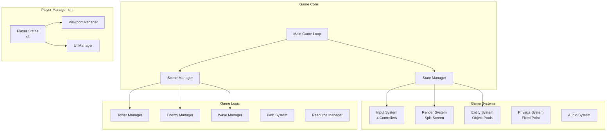
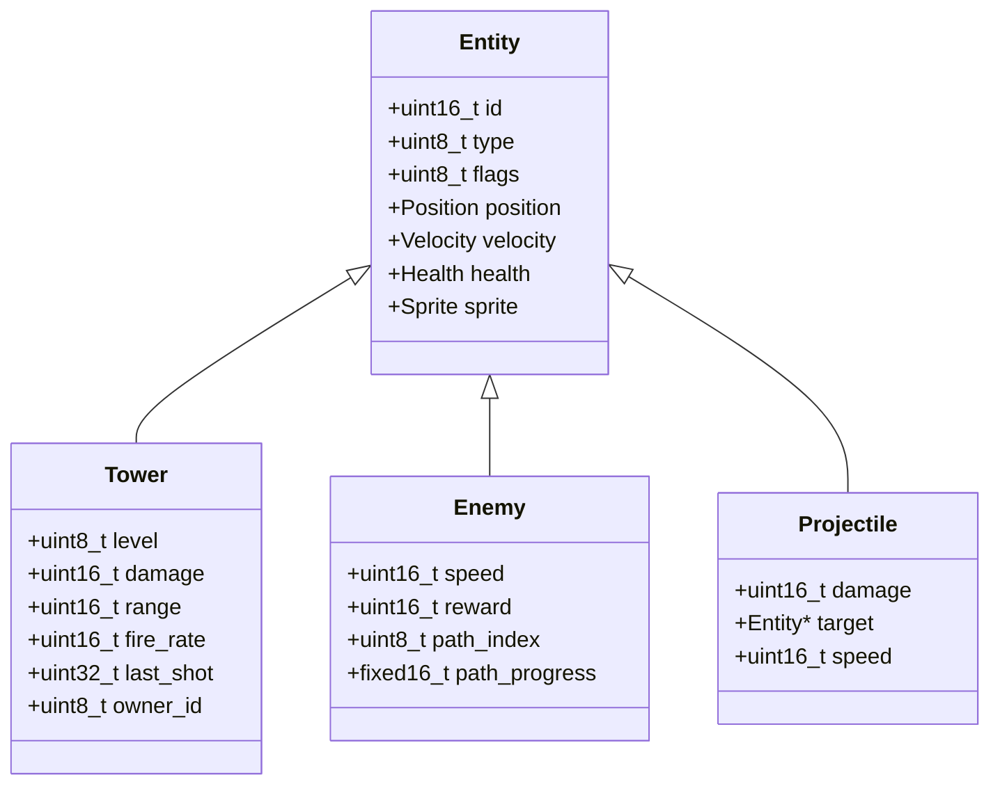
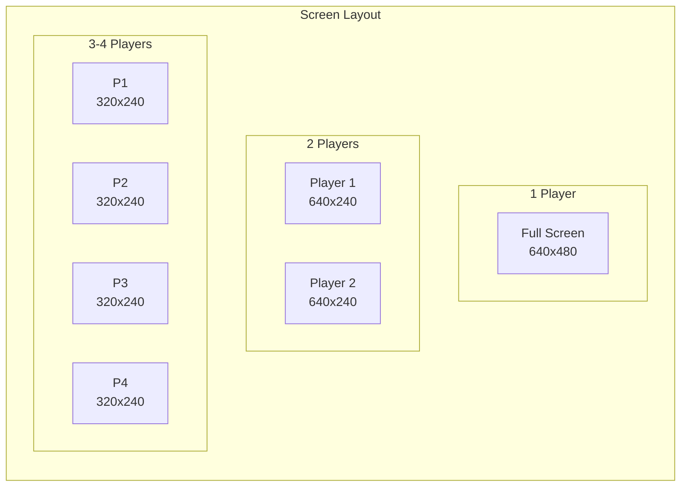
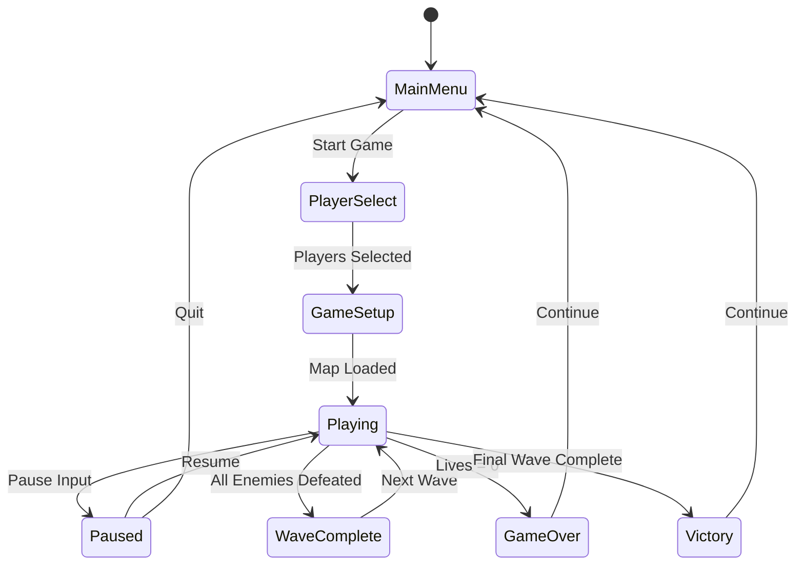
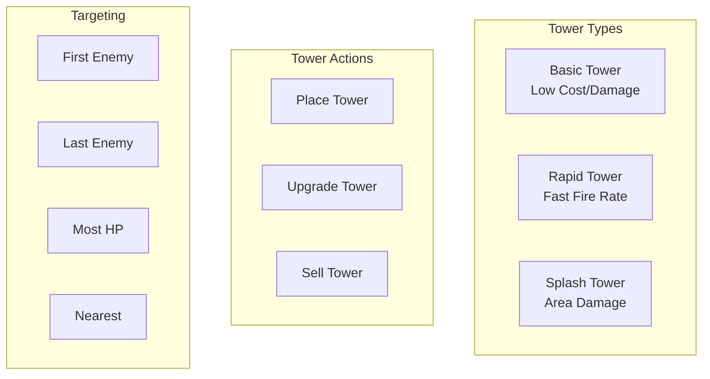
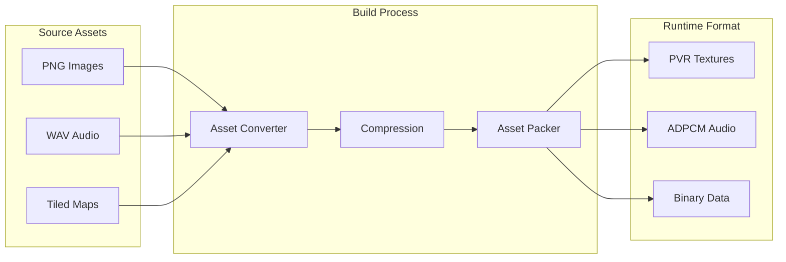

# Tower Defense Game Architecture

## Overview

This document outlines the architecture of our Dreamcast tower defense game, designed to support 1-4 players in local split-screen multiplayer. The architecture prioritizes performance and memory efficiency while maintaining clean, extensible code.

## High-Level Game Architecture



## Core Game Loop

```c
// Simplified game loop structure
void game_loop() {
    const int TARGET_FPS = 60;
    const int FRAME_TIME = 1000 / TARGET_FPS;
    
    uint32_t last_time = get_milliseconds();
    uint32_t accumulator = 0;
    
    while (game_running) {
        uint32_t current_time = get_milliseconds();
        uint32_t delta_time = current_time - last_time;
        last_time = current_time;
        
        accumulator += delta_time;
        
        // Fixed timestep for physics/logic
        while (accumulator >= FRAME_TIME) {
            input_system_update();
            game_logic_update(FRAME_TIME);
            accumulator -= FRAME_TIME;
        }
        
        // Render at actual framerate
        render_system_draw(delta_time);
        
        // Frame limiting
        frame_limit(TARGET_FPS);
    }
}
```

## Entity Component System (ECS)

### Entity Structure



### Object Pool Implementation

```c
// Memory-efficient object pooling
typedef struct {
    Enemy enemies[MAX_ENEMIES];
    uint8_t active_flags[MAX_ENEMIES / 8];  // Bit flags
    uint16_t active_count;
    uint16_t next_free;
} EnemyPool;

// Fast allocation from pool
Enemy* enemy_pool_allocate(EnemyPool* pool) {
    if (pool->active_count >= MAX_ENEMIES) return NULL;
    
    // Find first free slot
    uint16_t index = pool->next_free;
    SET_BIT(pool->active_flags, index);
    pool->active_count++;
    
    // Update next_free
    for (uint16_t i = index + 1; i < MAX_ENEMIES; i++) {
        if (!GET_BIT(pool->active_flags, i)) {
            pool->next_free = i;
            break;
        }
    }
    
    return &pool->enemies[index];
}
```

## Multiplayer Architecture

### Split-Screen Rendering



### Player State Management

```c
typedef struct {
    uint8_t player_id;
    uint16_t resources;
    uint8_t selected_tower_type;
    
    // Viewport info
    uint16_t viewport_x, viewport_y;
    uint16_t viewport_width, viewport_height;
    
    // Camera position (for panning)
    fixed16_t camera_x, camera_y;
    
    // UI state
    uint8_t cursor_tile_x, cursor_tile_y;
    uint8_t menu_selection;
    
    // Stats
    uint16_t towers_built;
    uint32_t damage_dealt;
    uint16_t enemies_killed;
} PlayerState;

// Global player states
PlayerState players[MAX_PLAYERS];
uint8_t active_player_count;
```

## Game State Flow



## Tower Defense Mechanics

### Tower System



### Enemy Wave System

```c
typedef struct {
    uint8_t enemy_type;
    uint16_t count;
    uint16_t spawn_delay;  // Frames between spawns
} WaveSegment;

typedef struct {
    WaveSegment segments[MAX_SEGMENTS_PER_WAVE];
    uint8_t segment_count;
    uint16_t wave_number;
    uint32_t start_time;
} Wave;

// Wave progression
Wave waves[] = {
    { // Wave 1 - Introduction
        .segments = {
            {ENEMY_BASIC, 10, 60},  // 10 basic enemies, 1 per second
        },
        .segment_count = 1,
        .wave_number = 1
    },
    { // Wave 2 - Mixed
        .segments = {
            {ENEMY_BASIC, 15, 30},
            {ENEMY_FAST, 5, 45},
        },
        .segment_count = 2,
        .wave_number = 2
    },
    // ... more waves
};
```

### Pathfinding System

```c
// Pre-calculated paths for performance
typedef struct {
    uint8_t x, y;
} PathNode;

typedef struct {
    PathNode nodes[MAX_PATH_LENGTH];
    uint8_t length;
    fixed16_t total_distance;
} Path;

// A* implementation optimized for fixed grid
void calculate_path(Path* path, uint8_t start_x, uint8_t start_y, 
                   uint8_t end_x, uint8_t end_y) {
    // Use integer math for performance
    // Pre-calculate common paths at level load
    // Cache results for identical start/end pairs
}
```

## Resource Management

### Memory Layout

```
Game Memory Map (16MB Total):
┌─────────────────────┐ 0x8C000000
│   KOS + Drivers     │ 1MB
├─────────────────────┤ 0x8C100000
│   Game Code         │ 2MB
├─────────────────────┤ 0x8C300000
│   Static Data       │ 2MB
│   - Textures        │
│   - Sounds          │
│   - Level Data      │
├─────────────────────┤ 0x8C500000
│   Object Pools      │ 4MB
│   - Enemies         │
│   - Towers          │
│   - Projectiles     │
│   - Particles       │
├─────────────────────┤ 0x8C900000
│   Dynamic Heap      │ 3MB
├─────────────────────┤ 0x8CC00000
│   Render Buffers    │ 3MB
├─────────────────────┤ 0x8CF00000
│   Stack             │ 1MB
└─────────────────────┘ 0x8D000000
```

### Asset Pipeline



## Performance Optimizations

### Rendering Optimizations

1. **Sprite Batching**: Group sprites by texture
2. **Culling**: Only render visible entities per viewport
3. **LOD System**: Reduce detail for distant objects
4. **Fixed Timestep**: Consistent physics updates

### CPU Optimizations

1. **Fixed-Point Math**: Avoid floating-point where possible
2. **Spatial Partitioning**: Grid-based collision detection
3. **Object Pooling**: Zero runtime allocations
4. **Cache-Friendly Layout**: Hot data together

### Memory Optimizations

1. **Texture Atlasing**: Reduce texture switches
2. **Compressed Audio**: ADPCM format
3. **Bit Packing**: Flags and small values
4. **Static Allocation**: Known limits at compile time

## Integration with PyGame Patterns

### Common Pattern Mappings

| PyGame Pattern | Raylib Equivalent | Notes |
|----------------|-------------------|-------|
| pygame.display.set_mode() | InitWindow() | Fixed resolution on DC |
| pygame.sprite.Group | Custom object pools | Manual management |
| pygame.time.Clock | GetFrameTime() | Built-in timing |
| pygame.mixer | LoadSound/PlaySound | Simpler API |
| pygame.Surface.blit() | DrawTexture() | Hardware accelerated |

## Next Steps

- Review [Multiplayer Design](multiplayer-design.md) for split-screen details
- Study [Performance Guide](performance-guide.md) for optimization
- See [PyGame Migration Guide](../pygame-to-raylib.md) for porting tips
