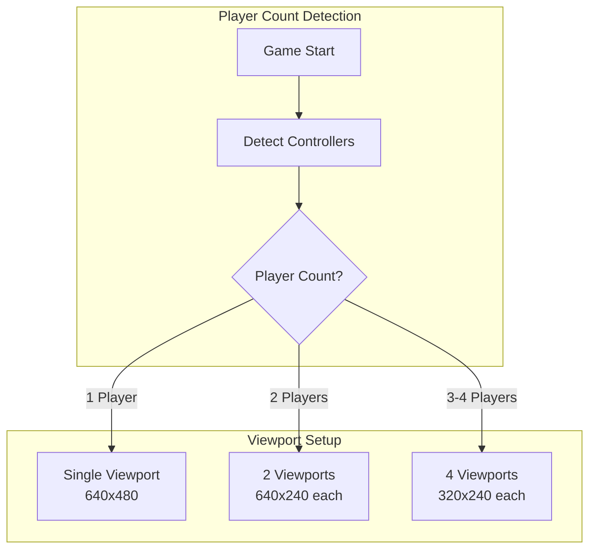
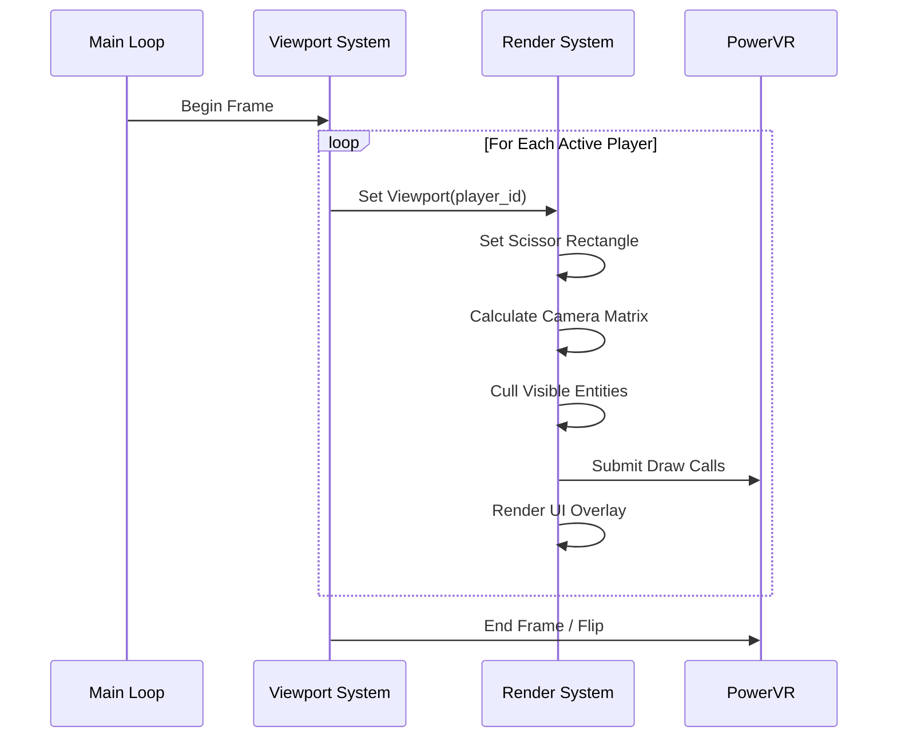
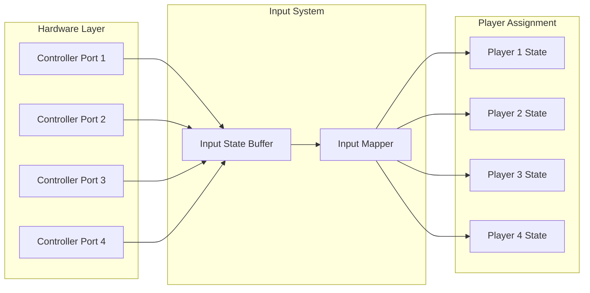
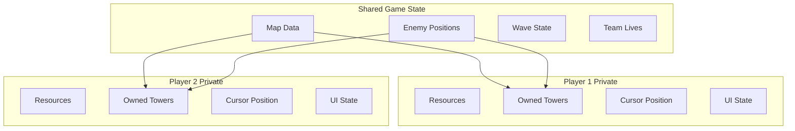
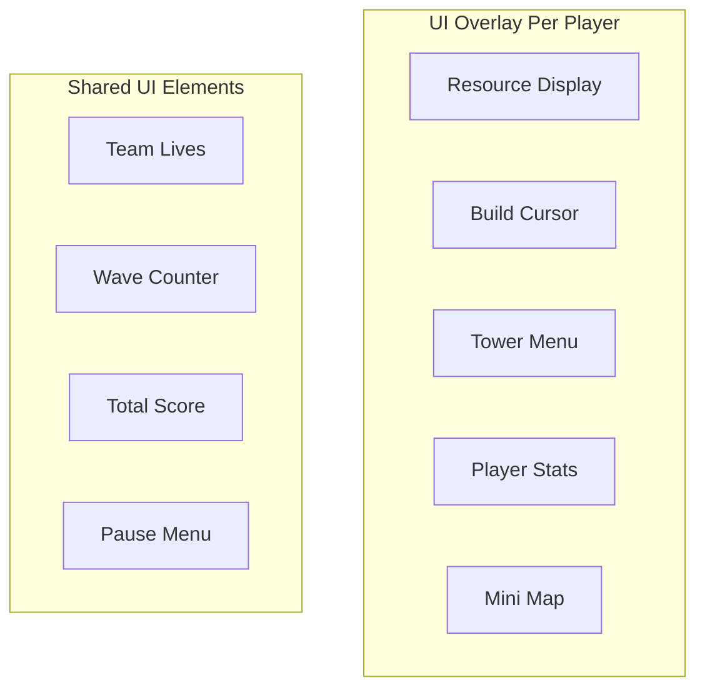

# Multiplayer Design Architecture

## Overview

This document details the split-screen multiplayer implementation for our Dreamcast tower defense game, supporting 1-4 players on a single console. The design prioritizes performance while maintaining a smooth, enjoyable multiplayer experience.

## Split-Screen Rendering Architecture

### Viewport Configuration



### Screen Layouts

```
1 Player Mode (640x480):
┌─────────────────────────┐
│                         │
│                         │
│      FULL SCREEN        │
│       VIEWPORT          │
│                         │
│                         │
└─────────────────────────┘

2 Player Mode (640x240 each):
┌─────────────────────────┐
│      PLAYER 1           │
│      VIEWPORT           │
├─────────────────────────┤
│      PLAYER 2           │
│      VIEWPORT           │
└─────────────────────────┘

3-4 Player Mode (320x240 each):
┌────────────┬────────────┐
│  PLAYER 1  │  PLAYER 2  │
│  VIEWPORT  │  VIEWPORT  │
├────────────┼────────────┤
│  PLAYER 3  │  PLAYER 4  │
│  VIEWPORT  │  VIEWPORT  │
└────────────┴────────────┘
```

## Rendering Pipeline

### Multi-Viewport Rendering Flow



### Viewport Implementation

```c
typedef struct {
    // Screen position and size
    int16_t x, y;
    uint16_t width, height;
    
    // World camera position
    float camera_x, camera_y;
    float zoom_level;
    
    // Rendering matrices
    MATRIX view_matrix;
    MATRIX projection_matrix;
    
    // Performance metrics
    uint16_t visible_entities;
    uint16_t draw_calls;
} Viewport;

// Viewport configurations by player count
const ViewportConfig viewport_configs[] = {
    // 1 Player
    {{0, 0, 640, 480}},
    
    // 2 Players (horizontal split)
    {{0, 0, 640, 240}, {0, 240, 640, 240}},
    
    // 3 Players (P1 top, P2/P3 bottom)
    {{0, 0, 640, 240}, {0, 240, 320, 240}, {320, 240, 320, 240}},
    
    // 4 Players (quad split)
    {{0, 0, 320, 240}, {320, 0, 320, 240}, 
     {0, 240, 320, 240}, {320, 240, 320, 240}}
};
```

## Input Management

### Controller Mapping



### Input State Management

```c
// Dreamcast controller button masks
#define CONT_A      (1<<0)
#define CONT_B      (1<<1)
#define CONT_X      (1<<2)
#define CONT_Y      (1<<3)
#define CONT_START  (1<<4)
#define CONT_DPAD_UP    (1<<5)
#define CONT_DPAD_DOWN  (1<<6)
#define CONT_DPAD_LEFT  (1<<7)
#define CONT_DPAD_RIGHT (1<<8)

typedef struct {
    uint16_t buttons;           // Current button state
    uint16_t buttons_pressed;   // Buttons pressed this frame
    uint16_t buttons_released;  // Buttons released this frame
    
    int8_t analog_x;           // Left analog X (-128 to 127)
    int8_t analog_y;           // Left analog Y (-128 to 127)
    
    uint8_t trigger_left;      // Left trigger (0-255)
    uint8_t trigger_right;     // Right trigger (0-255)
} InputState;

// Per-player input states
typedef struct {
    InputState current;
    InputState previous;
    
    // Game-specific mappings
    uint8_t cursor_speed;
    uint16_t repeat_timer;
    
    // Deadzone settings
    uint8_t analog_deadzone;
} PlayerInput;

PlayerInput player_inputs[MAX_PLAYERS];
```

## Game State Synchronization

### Shared vs. Private State



### State Management

```c
// Shared game state - all players see this
typedef struct {
    // Map state
    uint8_t map_tiles[MAP_WIDTH][MAP_HEIGHT];
    Path enemy_paths[MAX_PATHS];
    
    // Enemy state
    EnemyPool enemy_pool;
    Wave current_wave;
    uint32_t wave_timer;
    
    // Shared resources
    uint16_t team_lives;
    uint32_t total_score;
    
    // Game progression
    uint8_t current_wave_index;
    uint8_t game_difficulty;
    GamePhase phase;
} SharedGameState;

// Per-player private state
typedef struct {
    // Resources
    uint16_t gold;
    uint16_t mana;
    
    // Owned entities
    uint16_t tower_ids[MAX_TOWERS_PER_PLAYER];
    uint8_t tower_count;
    
    // UI state
    uint8_t cursor_x, cursor_y;
    TowerType selected_tower_type;
    uint8_t build_preview_valid;
    
    // Camera
    float camera_x, camera_y;
    float target_camera_x, target_camera_y;
    
    // Stats
    PlayerStats stats;
} PlayerGameState;
```

## Performance Optimization

### Rendering Optimizations

```c
// Frustum culling per viewport
typedef struct {
    fixed16_t left, right;
    fixed16_t top, bottom;
} Frustum;

bool entity_in_frustum(Entity* entity, Frustum* frustum) {
    // Quick AABB test with fixed-point math
    return entity->x + entity->width > frustum->left &&
           entity->x < frustum->right &&
           entity->y + entity->height > frustum->top &&
           entity->y < frustum->bottom;
}

// Render only visible entities per viewport
void render_viewport(int player_id, Viewport* viewport) {
    Frustum frustum = calculate_frustum(viewport);
    
    // Clear stats
    viewport->visible_entities = 0;
    viewport->draw_calls = 0;
    
    // Set viewport scissor
    pvr_set_scissor(viewport->x, viewport->y, 
                    viewport->width, viewport->height);
    
    // Render terrain (cached per frame)
    render_terrain_cached(viewport);
    
    // Render entities with culling
    for (int i = 0; i < entity_count; i++) {
        if (entity_in_frustum(&entities[i], &frustum)) {
            render_entity(&entities[i]);
            viewport->visible_entities++;
        }
    }
    
    // Render player-specific UI
    render_player_ui(player_id, viewport);
}
```

### Memory Optimization

```c
// Shared texture cache to avoid duplication
typedef struct {
    pvr_ptr_t texture_ptr;
    uint16_t width, height;
    uint16_t ref_count;
    uint32_t last_used_frame;
} TextureCache;

// Viewport-specific render lists
typedef struct {
    uint16_t entity_indices[MAX_VISIBLE_ENTITIES];
    uint16_t count;
    uint8_t needs_sort;
} ViewportRenderList;

// Pre-allocated per viewport to avoid allocations
ViewportRenderList render_lists[MAX_PLAYERS];
```

## UI/UX Considerations

### Player-Specific UI Elements



### UI Scaling

```c
// UI element sizes adjust based on player count
const UIScale ui_scales[] = {
    {1.0f, 1.0f},    // 1 player - full size
    {1.0f, 0.8f},    // 2 players - slightly smaller
    {0.7f, 0.7f},    // 3-4 players - compact
};

// Adaptive UI positioning
void position_ui_element(UIElement* element, int player_count) {
    UIScale scale = ui_scales[min(player_count - 1, 2)];
    
    element->render_width = element->base_width * scale.x;
    element->render_height = element->base_height * scale.y;
    
    // Adjust font size for readability
    element->font_size = max(8, element->base_font_size * scale.x);
}
```

## Cooperative Mechanics

### Resource Sharing

```c
// Player can send resources to teammates
typedef struct {
    uint8_t from_player;
    uint8_t to_player;
    uint16_t gold_amount;
    uint16_t mana_amount;
} ResourceTransfer;

void process_resource_transfer(ResourceTransfer* transfer) {
    PlayerGameState* from = &players[transfer->from_player];
    PlayerGameState* to = &players[transfer->to_player];
    
    // Validate transfer
    if (from->gold >= transfer->gold_amount &&
        from->mana >= transfer->mana_amount) {
        
        from->gold -= transfer->gold_amount;
        from->mana -= transfer->mana_amount;
        
        to->gold += transfer->gold_amount;
        to->mana += transfer->mana_amount;
        
        // Show visual feedback
        show_transfer_effect(transfer);
    }
}
```

### Combo System

```c
// Towers can combo when owned by different players
typedef struct {
    TowerType tower1_type;
    TowerType tower2_type;
    ComboEffect effect;
    float damage_multiplier;
    uint16_t range_bonus;
} TowerCombo;

const TowerCombo combos[] = {
    {TOWER_FIRE, TOWER_ICE, COMBO_STEAM, 1.5f, 50},
    {TOWER_ELECTRIC, TOWER_WATER, COMBO_SHOCK, 2.0f, 100},
    // ... more combos
};

void check_tower_combos(Tower* tower) {
    // Find nearby allied towers owned by other players
    for (int i = 0; i < tower_count; i++) {
        Tower* other = &towers[i];
        
        if (other->owner_id != tower->owner_id &&
            distance(tower, other) < COMBO_RANGE) {
            
            // Check for valid combo
            apply_combo_effect(tower, other);
        }
    }
}
```

## Balancing Considerations

### Difficulty Scaling

```c
// Scale difficulty based on player count
const DifficultyScale player_scaling[] = {
    {1.0f, 1.0f, 1.0f},  // 1P: Normal
    {1.2f, 1.5f, 0.8f},  // 2P: More enemies, more resources, slower
    {1.5f, 2.0f, 0.7f},  // 3P: Even more enemies, more resources
    {2.0f, 2.5f, 0.6f},  // 4P: Maximum enemies, maximum resources
};

typedef struct {
    float enemy_count_mult;
    float resource_mult;
    float enemy_speed_mult;
} DifficultyScale;
```

### Performance Scaling

```c
// Reduce visual effects based on player count
typedef struct {
    uint8_t max_particles_per_player;
    uint8_t shadow_quality;
    uint8_t texture_detail;
    bool enable_screen_shake;
} QualitySettings;

const QualitySettings quality_by_players[] = {
    {100, QUALITY_HIGH, DETAIL_HIGH, true},    // 1 player
    {50,  QUALITY_MED,  DETAIL_HIGH, true},    // 2 players
    {25,  QUALITY_LOW,  DETAIL_MED,  false},   // 3 players
    {20,  QUALITY_OFF,  DETAIL_LOW,  false},   // 4 players
};
```

## Testing Considerations

### Multiplayer Test Scenarios

1. **Controller Hot-Swapping**: Players joining/leaving mid-game
2. **Performance Testing**: Ensure 60 FPS with 4 players
3. **UI Readability**: Text size at different player counts
4. **Balance Testing**: Difficulty scaling validation
5. **Split-Screen Edge Cases**: Objects crossing viewport boundaries

## Next Steps

- Review [Performance Guide](performance-guide.md) for optimization techniques
- See [Game Architecture](game-architecture.md) for overall structure
- Check example implementation in `src/multiplayer/`
