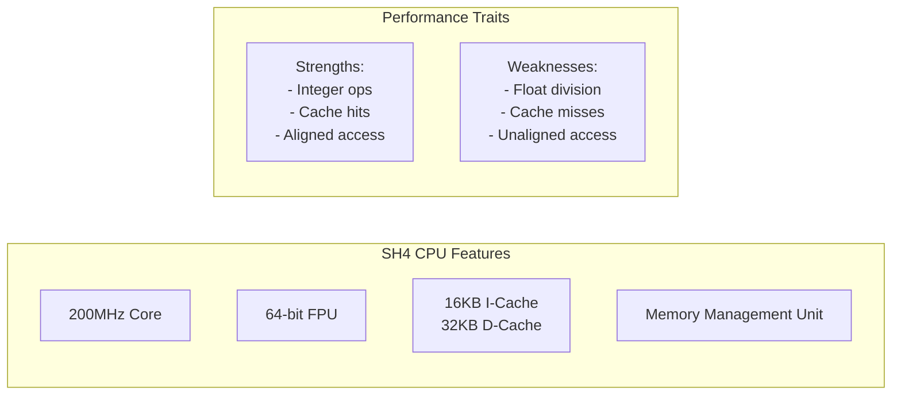

# Dreamcast Performance Optimization Guide

## Overview

This guide provides comprehensive performance optimization strategies for Dreamcast game development. Given the hardware limitations (200MHz CPU, 16MB RAM), every optimization counts toward achieving a stable 60 FPS experience.

## Hardware Performance Characteristics

### CPU Performance



### Memory Bandwidth

| Memory Type | Bandwidth | Latency | Best Use |
|------------|-----------|---------|----------|
| Cache | 1.6 GB/s | 1 cycle | Hot data |
| Main RAM | 800 MB/s | ~10 cycles | General data |
| Video RAM | 400 MB/s | ~20 cycles | Textures |
| Sound RAM | 100 MB/s | ~40 cycles | Audio only |

## Performance Profiling

### Frame Time Budget

```
Target: 60 FPS = 16.67ms per frame

Typical Frame Breakdown:
├── Game Logic: 4-6ms
├── Physics: 2-3ms
├── Rendering: 6-8ms
├── Audio: 1-2ms
└── Buffer: 2-3ms (for spikes)
```

### Profiling Implementation

```c
// Performance timer structure
typedef struct {
    uint64_t start_time;
    uint64_t end_time;
    uint64_t accumulated;
    uint32_t sample_count;
    char name[32];
} PerfTimer;

// Profiling macros
#define PROF_START(timer) timer.start_time = timer_us_gettime64()
#define PROF_END(timer) { \
    timer.end_time = timer_us_gettime64(); \
    timer.accumulated += (timer.end_time - timer.start_time); \
    timer.sample_count++; \
}

// Frame timing
PerfTimer frame_timers[] = {
    {.name = "Input"},
    {.name = "Game Logic"},
    {.name = "Physics"},
    {.name = "Rendering"},
    {.name = "Audio"},
    {.name = "Total Frame"}
};

// Performance HUD display
void draw_performance_hud() {
    int y = 10;
    for (int i = 0; i < TIMER_COUNT; i++) {
        float avg_ms = (frame_timers[i].accumulated / 
                       frame_timers[i].sample_count) / 1000.0f;
        
        draw_text(10, y, "%.16s: %.2fms", 
                  frame_timers[i].name, avg_ms);
        y += 12;
    }
}
```

## CPU Optimization Techniques

### 1. Fixed-Point Mathematics

```c
// Fixed-point type (16.16 format)
typedef int32_t fixed16_t;

#define FIXED_SHIFT 16
#define FIXED_ONE (1 << FIXED_SHIFT)
#define INT_TO_FIXED(x) ((x) << FIXED_SHIFT)
#define FIXED_TO_INT(x) ((x) >> FIXED_SHIFT)
#define FLOAT_TO_FIXED(x) ((fixed16_t)((x) * FIXED_ONE))
#define FIXED_TO_FLOAT(x) ((float)(x) / FIXED_ONE)

// Fast fixed-point operations
static inline fixed16_t fixed_mul(fixed16_t a, fixed16_t b) {
    return (fixed16_t)(((int64_t)a * b) >> FIXED_SHIFT);
}

static inline fixed16_t fixed_div(fixed16_t a, fixed16_t b) {
    return (fixed16_t)(((int64_t)a << FIXED_SHIFT) / b);
}

// Example: Distance calculation
fixed16_t fixed_distance(fixed16_t x1, fixed16_t y1, 
                        fixed16_t x2, fixed16_t y2) {
    fixed16_t dx = x2 - x1;
    fixed16_t dy = y2 - y1;
    
    // Approximate sqrt using Newton-Raphson
    fixed16_t sum = fixed_mul(dx, dx) + fixed_mul(dy, dy);
    return fixed_sqrt(sum);  // Custom implementation
}
```

### 2. Cache Optimization

```c
// Structure packing for cache efficiency
typedef struct {
    // Hot data together (accessed every frame)
    struct {
        fixed16_t x, y;        // Position
        fixed16_t vx, vy;      // Velocity
        uint16_t health;       // Current health
        uint8_t type;          // Entity type
        uint8_t flags;         // Active, visible, etc.
    } hot;  // 20 bytes - fits in cache line
    
    // Cold data (accessed rarely)
    struct {
        char name[32];         // Debug name
        uint32_t created_at;   // Timestamp
        uint16_t max_health;   // Max health
        uint16_t score_value;  // Points when killed
    } cold;
} Entity;

// Array of Structures vs Structure of Arrays
// Bad for cache:
Entity entities[MAX_ENTITIES];

// Good for cache (when processing specific components):
typedef struct {
    fixed16_t x[MAX_ENTITIES];
    fixed16_t y[MAX_ENTITIES];
    fixed16_t vx[MAX_ENTITIES];
    fixed16_t vy[MAX_ENTITIES];
} EntityPositions;
```

### 3. Loop Optimization

```c
// Loop unrolling for performance
void update_entities_optimized(EntityPositions* pos, int count) {
    int i;
    
    // Process 4 entities at a time
    for (i = 0; i < count - 3; i += 4) {
        pos->x[i]   += pos->vx[i];
        pos->y[i]   += pos->vy[i];
        pos->x[i+1] += pos->vx[i+1];
        pos->y[i+1] += pos->vy[i+1];
        pos->x[i+2] += pos->vx[i+2];
        pos->y[i+2] += pos->vy[i+2];
        pos->x[i+3] += pos->vx[i+3];
        pos->y[i+3] += pos->vy[i+3];
    }
    
    // Handle remaining entities
    for (; i < count; i++) {
        pos->x[i] += pos->vx[i];
        pos->y[i] += pos->vy[i];
    }
}
```

## Memory Optimization

### Memory Pool Pattern

```c
// Generic memory pool implementation
typedef struct {
    void* memory;
    size_t block_size;
    size_t block_count;
    uint32_t* free_list;
    uint32_t free_count;
} MemoryPool;

MemoryPool* pool_create(size_t block_size, size_t count) {
    MemoryPool* pool = malloc(sizeof(MemoryPool));
    pool->block_size = block_size;
    pool->block_count = count;
    pool->memory = memalign(32, block_size * count);  // 32-byte aligned
    pool->free_list = malloc(count * sizeof(uint32_t));
    pool->free_count = count;
    
    // Initialize free list
    for (size_t i = 0; i < count; i++) {
        pool->free_list[i] = i;
    }
    
    return pool;
}

void* pool_alloc(MemoryPool* pool) {
    if (pool->free_count == 0) return NULL;
    
    uint32_t index = pool->free_list[--pool->free_count];
    return (char*)pool->memory + (index * pool->block_size);
}

void pool_free(MemoryPool* pool, void* ptr) {
    uint32_t index = ((char*)ptr - (char*)pool->memory) / pool->block_size;
    pool->free_list[pool->free_count++] = index;
}
```

### Memory Usage Tracking

```c
// Memory tracking system
typedef struct {
    size_t total_allocated;
    size_t peak_allocated;
    size_t allocation_count;
    struct {
        const char* name;
        size_t current;
        size_t peak;
    } categories[16];
} MemoryStats;

static MemoryStats g_memory_stats;

void* tracked_malloc(size_t size, const char* category) {
    void* ptr = malloc(size);
    if (ptr) {
        g_memory_stats.total_allocated += size;
        g_memory_stats.allocation_count++;
        
        // Update peak
        if (g_memory_stats.total_allocated > g_memory_stats.peak_allocated) {
            g_memory_stats.peak_allocated = g_memory_stats.total_allocated;
        }
        
        // Track by category
        // ... category tracking code ...
    }
    return ptr;
}
```

## Rendering Optimization

### PowerVR Optimization

```c
// PVR-specific optimizations
typedef struct {
    pvr_poly_hdr_t hdr;
    pvr_vertex_t vertices[4];
} PVRSprite;

// Batch sprites by texture
typedef struct {
    pvr_ptr_t texture;
    PVRSprite* sprites;
    uint16_t count;
    uint16_t capacity;
} SpriteBatch;

void batch_add_sprite(SpriteBatch* batch, float x, float y, 
                     float w, float h, uint32_t color) {
    if (batch->count >= batch->capacity) {
        batch_flush(batch);
    }
    
    PVRSprite* sprite = &batch->sprites[batch->count++];
    
    // Set up vertices (clockwise winding)
    sprite->vertices[0].x = x;
    sprite->vertices[0].y = y;
    sprite->vertices[0].z = 1.0f;
    sprite->vertices[0].u = 0.0f;
    sprite->vertices[0].v = 0.0f;
    sprite->vertices[0].argb = color;
    
    // ... set up other 3 vertices ...
}

void batch_flush(SpriteBatch* batch) {
    if (batch->count == 0) return;
    
    // Submit all sprites in one go
    pvr_prim(&batch->sprites[0].hdr, sizeof(PVRSprite) * batch->count);
    batch->count = 0;
}
```

### Texture Optimization

```c
// Texture atlas to reduce state changes
typedef struct {
    pvr_ptr_t texture;
    uint16_t width, height;
    
    struct {
        uint16_t x, y, w, h;
    } regions[MAX_ATLAS_REGIONS];
    
    uint16_t region_count;
} TextureAtlas;

// Compressed texture loading
pvr_ptr_t load_compressed_texture(const char* filename) {
    FILE* file = fopen(filename, "rb");
    
    // Read header
    struct {
        uint16_t width, height;
        uint8_t format;
        uint8_t mipmaps;
    } header;
    
    fread(&header, sizeof(header), 1, file);
    
    // Allocate in VRAM
    size_t size = calculate_vq_size(header.width, header.height);
    pvr_ptr_t texture = pvr_mem_malloc(size);
    
    // Load compressed data directly to VRAM
    fread(texture, 1, size, file);
    fclose(file);
    
    return texture;
}
```

## Audio Optimization

### ADPCM Compression

```c
// ADPCM audio loading for reduced memory
typedef struct {
    uint8_t* data;
    uint32_t size;
    uint16_t sample_rate;
    uint8_t channels;
    uint8_t bits_per_sample;
} ADPCMSound;

// Streaming audio for large files
typedef struct {
    FILE* file;
    uint8_t* buffer[2];  // Double buffer
    uint32_t buffer_size;
    uint8_t active_buffer;
    snd_stream_hnd_t stream;
} AudioStream;

void* audio_stream_callback(snd_stream_hnd_t hnd, 
                           int samples_requested, int* samples_returned) {
    AudioStream* stream = (AudioStream*)snd_stream_get_userdata(hnd);
    
    // Swap buffers
    stream->active_buffer ^= 1;
    
    // Read next chunk in background
    fread(stream->buffer[stream->active_buffer], 1, 
          stream->buffer_size, stream->file);
    
    *samples_returned = samples_requested;
    return stream->buffer[stream->active_buffer ^ 1];
}
```

## Dreamcast-Specific Optimizations

### Store Queues

```c
// Use store queues for fast memory writes
#define SQ0 ((uint32_t *)0xe0000000)
#define SQ1 ((uint32_t *)0xe0000020)

void fast_memcpy32(void* dest, const void* src, size_t size) {
    uint32_t* d = (uint32_t*)dest;
    const uint32_t* s = (const uint32_t*)src;
    size_t chunks = size / 32;  // 32 bytes per store queue
    
    while (chunks--) {
        // Fill store queue
        SQ0[0] = s[0]; SQ0[1] = s[1];
        SQ0[2] = s[2]; SQ0[3] = s[3];
        SQ0[4] = s[4]; SQ0[5] = s[5];
        SQ0[6] = s[6]; SQ0[7] = s[7];
        
        // Flush to destination
        asm volatile("pref @%0" : : "r"(d));
        
        s += 8;
        d += 8;
    }
}
```

### DMA Operations

```c
// Use DMA for large transfers
void dma_copy(void* dest, const void* src, size_t size) {
    // Set up G2 DMA for texture uploads
    g2_dma_transfer(dest, src, size, 0, 
                    G2_DMA_CHAN0, G2_DMA_MODE_NORMAL);
    
    // Wait for completion
    while (!g2_dma_ready(G2_DMA_CHAN0));
}
```

## Performance Checklist

### Pre-Release Optimization

- [ ] Profile all major systems
- [ ] Eliminate dynamic allocations in game loop
- [ ] Batch all similar draw calls
- [ ] Compress all textures (VQ format)
- [ ] Convert audio to ADPCM
- [ ] Implement LOD for distant objects
- [ ] Cache frequently calculated values
- [ ] Align all critical data structures
- [ ] Remove debug code in release builds
- [ ] Test on real hardware (not just emulator)

### Common Performance Issues

1. **Texture Thrashing**: Too many texture switches
   - Solution: Use texture atlases
   
2. **Cache Misses**: Poor data layout
   - Solution: Pack hot data together
   
3. **Float Operations**: Excessive FPU usage
   - Solution: Use fixed-point math
   
4. **Memory Fragmentation**: Dynamic allocations
   - Solution: Use object pools

## Debugging Performance

### Performance Overlay

```c
void draw_debug_overlay() {
    // FPS counter
    static uint32_t frame_count = 0;
    static uint32_t last_fps_time = 0;
    static float current_fps = 0.0f;
    
    uint32_t current_time = timer_ms_gettime();
    frame_count++;
    
    if (current_time - last_fps_time >= 1000) {
        current_fps = frame_count * 1000.0f / 
                     (current_time - last_fps_time);
        frame_count = 0;
        last_fps_time = current_time;
    }
    
    // Draw overlay
    draw_text(10, 10, "FPS: %.1f", current_fps);
    draw_text(10, 22, "Entities: %d", active_entity_count);
    draw_text(10, 34, "Draw Calls: %d", frame_draw_calls);
    draw_text(10, 46, "Memory: %dKB / %dKB", 
              g_memory_stats.total_allocated / 1024,
              16 * 1024);  // 16MB total
}
```

## Next Steps

- Implement profiling in your game loop
- Start with CPU optimizations (biggest impact)
- Test each optimization on real hardware
- Monitor memory usage continuously
- Keep optimization log for future reference
