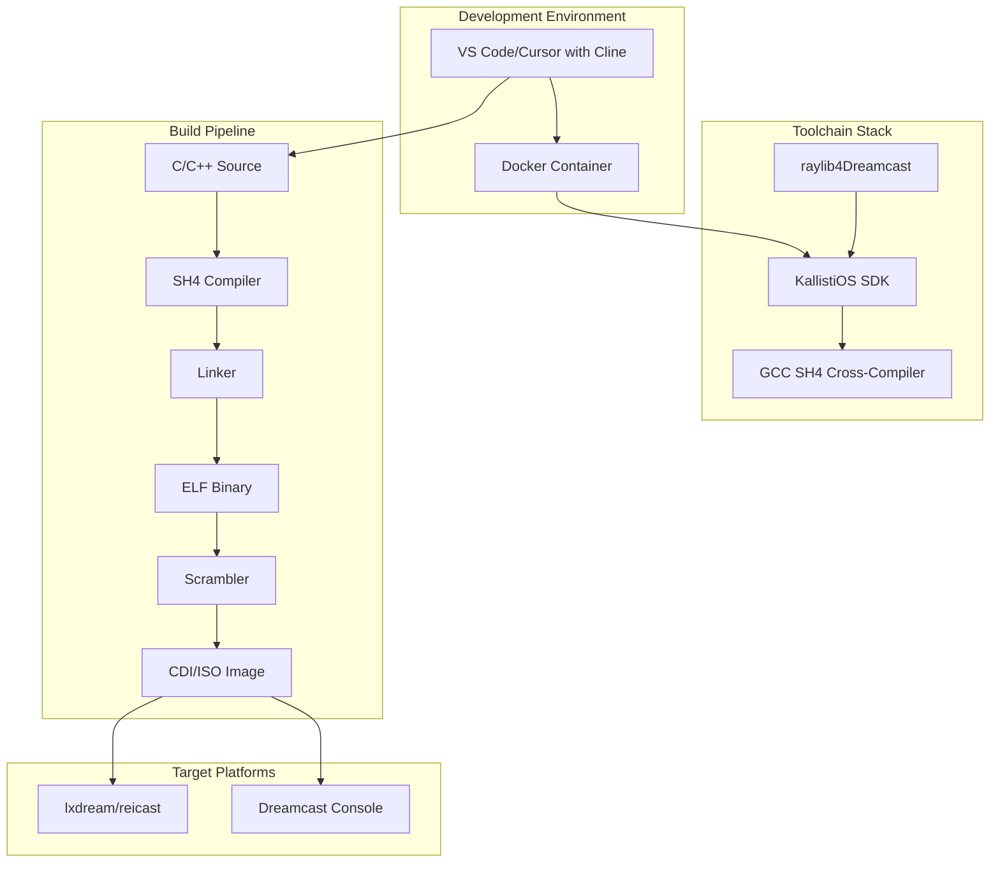
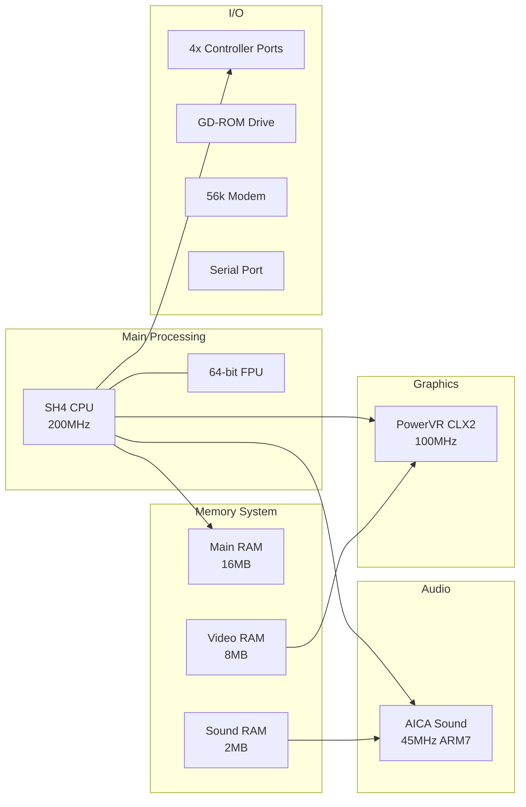
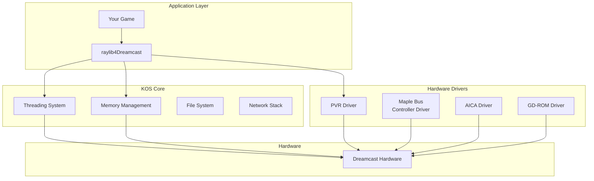
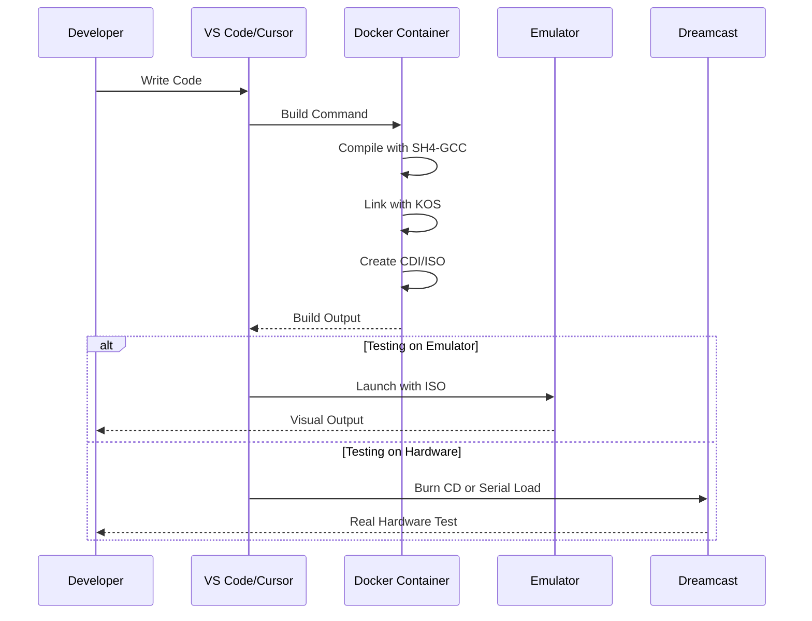

# Dreamcast Game Development System Architecture

## Overview

This document provides a comprehensive overview of the Dreamcast game development architecture for senior developers who are new to the platform. Our system leverages modern development practices while respecting the unique constraints of the Dreamcast hardware.

## System Architecture Diagram



## Hardware Architecture

### Dreamcast Hardware Specifications



### Memory Layout

| Memory Region | Size | Purpose | Access Speed |
|--------------|------|---------|--------------|
| Main RAM | 16MB | Code, Data, Stack | Fast |
| Video RAM | 8MB | Textures, Framebuffer | Medium |
| Sound RAM | 2MB | Audio Samples | Slow |
| ROM | 2MB | BIOS | Fast |

## Software Stack

### KallistiOS (KOS) Architecture

KallistiOS provides the low-level interface to Dreamcast hardware:



### Raylib for Dreamcast

Raylib provides a higher-level game development API:

- **Window Management**: Handles display initialization
- **Input System**: Unified controller input
- **2D/3D Graphics**: Simplified rendering API
- **Audio**: Sound loading and playback
- **Math**: Vector and matrix operations

## Development Workflow



## Key Architectural Decisions

### 1. Fixed-Point Math
- Dreamcast's SH4 has limited floating-point performance
- Use fixed-point (16.16 format) for game logic
- Reserve floating-point for critical 3D calculations

### 2. Memory Management
- No virtual memory or swap
- All 16MB must be carefully managed
- Use object pools and static allocation

### 3. Rendering Pipeline
- PowerVR is tile-based deferred renderer
- Minimize state changes
- Sort by texture to reduce swapping

### 4. Threading Model
- Cooperative threading via KOS
- Main thread for game logic
- Separate threads for audio/input

## Performance Considerations

### CPU Budget (per frame at 60 FPS)
- Total: 3.33 million cycles
- Game Logic: ~1.5M cycles
- Rendering: ~1M cycles
- Audio/Input: ~0.5M cycles
- Buffer: ~0.33M cycles

### Memory Budget
```
Total RAM: 16MB
- KOS Kernel: ~1MB
- Game Code: ~2MB
- Static Data: ~2MB
- Dynamic Heap: ~6MB
- Stack: ~1MB
- Buffers: ~4MB
```

## Integration Points

### Docker Development Container
- Ubuntu 22.04 base
- SH4 cross-compilation toolchain
- KallistiOS pre-configured
- Raylib4Dreamcast included
- Build scripts automated

### Emulator Integration
- lxdream for Linux/Mac
- reicast for cross-platform
- Automated launch from IDE
- Controller mapping pre-configured

### Performance Monitoring
- Frame time measurement
- Memory usage tracking
- OpenTelemetry integration
- Real-time metrics display

## Best Practices

1. **Always Profile**: Use the built-in profiling tools
2. **Test on Hardware**: Emulators aren't 100% accurate
3. **Manage Memory**: Track every allocation
4. **Optimize Early**: Performance issues compound
5. **Use Hardware Features**: Leverage PVR's strengths

## Next Steps

- Review [Game Architecture](game-architecture.md) for game-specific patterns
- Study [Performance Guide](performance-guide.md) for optimization techniques
- See [Multiplayer Design](multiplayer-design.md) for split-screen implementation
